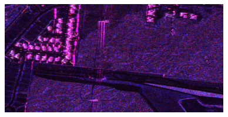
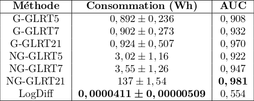
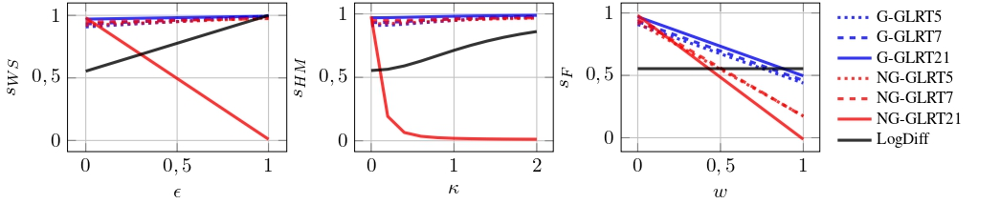

# Évaluation de la Frugalité des Algorithmes de Traitement de Données de Télédétection

Ce dépôt contient le code associé à l'article [*Frugalité en télédétection : évaluer la performance et la consommation énergétique en détection de changements d'images PolSAR*](doc/submit_GRETSI_2025.pdf) pour effectuer une analyse de la frugalité sur des tâches de clustering et de détection de changements.

> Dans les applications de télédétection, la demande d'algorithmes de traitements de données complexes augmente exponentiellement. En parallèle, évaluer la frugalité de telles méthodes est une priorité dans la communauté de l'apprentissage machine et de l'intelligence artificielle. Dans ce cadre, créer une mesure combinant performance et consommation énergétique est une tâche complexe. Cet article présente une méthodologie de collecte de données de consommation énergétique et explore trois méthodes de création de score de frugalité. À travers une étude de cas sur une tâche classique en télédétection, la détection de changements, nous montrons que ces trois scores capturent trois différents aspects de la frugalité. Nous recommandons alors une approche combinatoire de ces scores afin de réaliser une évaluation plus complète.

Ce travail repose sur le sous-module [performance-tracking](https://github.com/MattVerlynde/performance-tracking.git) contenant des scripts pour chaque algorithme de traitement de données ainsi qu'un guide et des fichiers de configuration pour le pipeline de collecte de données.

#### Table des matières

- [Structure du dépôt](#structure)
- [Installation](#install)
  - [Dépendances](#dependencies)
- [Données](#data)
- [Utilisation](#use)
- [Reproductibilité](#reproducibility)
- [Auteurs](#authors)
- [Références](#references)

## Structure du Dépôt <a name="structure"></a>

```bash
.
├── data
│   └── ...
├── doc
│   ├── static
│   │   ├── Scene_1small.png
│   │   └── Scene_1small_truth.png
│   └── submit_GRETSI_2025.pdf
├── environment.yml
├── LICENCE
├── README.md
└── src
    └── performance-tracking
        ├── experiments
        │   ├── conso
        │   │   ├── analyse_stats.py
        │   │   ├── get_conso.py
        │   │   ├── get_stats.py
        │   │   ├── query_influx.sh
        │   │   ├── simulation_metrics_exec.sh
        │   │   ├── stats_summary_blob.py
        │   │   ├── stats_summary_deep.py
        │   │   └── stats_summary.py
        │   ├── conso_change
        │   │   ├── cd_sklearn_pair_var.py
        │   │   ├── change-detection.py
        │   │   ├── functions.py
        │   │   ├── get_perf.py
        │   │   ├── helpers
        │   │   │   └── multivariate_images_tool.py
        │   │   └── main.py
        │   ├── conso_classif_deep
        │   │   ├── classif_deep.py
        │   │   ├── get_perf.py
        │   │   ├── get_scores.py
        │   │   ├── read_event.py
        │   │   ├── read_events.py
        │   │   └── simulation_metrics_exec.sh
        │   └── conso_clustering
        │       ├── clustering_blob.py
        │       ├── clustering.py
        │       ├── get_perf_blob.py
        │       ├── get_perf.py
        │       ├── helpers
        │       │   └── processing_helpers.py
        │       ├── plot_clustering.py
        │       ├── utils_clustering_blob.py
        │       └── utils_clustering.py
        ├── plot_usage.py
        ├── README.md
        └── simulation_metrics_exec.sh
```

## Installation <a name="install"></a>

Installation de la chaîne de collecte de données : tutoriel disponible [ici](TUTORIAL.md).

### Dépendances <a name="dependencies"></a>

python 3.11.8, codecarbon 2.3.4, numpy 1.26.4, pandas 2.2.1, scikit-learn 1.4.1
```bash
conda env create -f environment.yml
conda activate frugal-score
```

## Données <a name="data"></a>

Ce dépôt présente le code pour l'évaluation de la frugalité pour une tâcheclassique de traitement de données de télédétection : la détection de changements.
Celle-ci a été réalisée sur des séries temporelles d'images PolSAR multibandes provenant de l'UAVSAR (Courtesy NASA/JPL-Caltech) [[1]](#1) avec des données de vérité terrain provenant de [[2]](#2).




## Utilisation <a name="use"></a>

| Fichier | Commande associée | Description |
| ---- | ------------------ | ----------- |
| [change-detection.py](https://github.com/MattVerlynde/performance-tracking/blob/main/experiments/conso_change/change-detection.py)  | `python change-detection.py --storage_path [CHEMIN_VERS_DOSSIER_POUR_STOCKER_LES_RÉSULTATS] --image [CHEMIN_VERS_DOSSIER_AVEC_IMAGES] --window [TAILLE_DE_FENÊTRE] --cores [NOMBRE_DE_CORES_UTILISÉS] --number_run [NOMBRE_DE_RUNS] --robust [ID_DE_ROBUSTESSE]` | Exécute des algorithmes de détection de changements sur les données UAVSAR |
| [plot_change_detection.py](src/plot_change_detection.py)  | `python plot_change_detection.py --result_path [CHEMIN_VERS_RÉSULTATS] --output_path [CHEMIN_DE_SORTIE]` | Trace les résultats des scores pour la détection de changements |

## Reproductibilité <a name="reproducibility"></a>

Pour reproduire la Table 1 de la [communication GRETSI](doc/submit_GRETSI_2025.pdf) :


```bash
qanat init .
qanat experiment new -f experiment.yml
qanat experiment run conso-change --param_file src/performance-tracking/experiments/conso_change/param_change.yaml

python src/performance-tracking/experiments/conso/stats_summary.py --id 0 -g 1 --storage_path results/conso-change

python src/plot_change_detection.py --result_path  --output_path 
```

Pour reproduire la Figure 2 de la [communication GRETSI](doc/submit_GRETSI_2025.pdf) :


| Fichier | Commande associée | Description |
| ---- | ------------------ | ----------- |
| [change-detection.py](https://github.com/MattVerlynde/performance-tracking/blob/main/experiments/conso_change/change-detection.py)  | `python change-detection.py --storage_path [CHEMIN_VERS_DOSSIER_POUR_STOCKER_LES_RÉSULTATS] --image [CHEMIN_VERS_DOSSIER_AVEC_IMAGES] --window [TAILLE_DE_FENÊTRE] --cores [NOMBRE_DE_CORES_UTILISÉS] --number_run [NOMBRE_DE_RUNS] --robust [ID_DE_ROBUSTESSE]` | Exécute des algorithmes de détection de changements sur les données UAVSAR |
| [clustering_blob.py](src/performance-tracking/experiments/conso_clustering/clustering_blob.py)  | `python clustering_blob.py --storage_path [CHEMIN_VERS_DOSSIER_POUR_STOCKER_LES_RÉSULTATS] --data_seed [SEED] --random_seed [SEED] --n_clusters [NOMBRE_DE_CLUSTERS] --model [MÉTHODE_DE_CLUSTERING] --repeat [NOMBRE_DE_RUNS_DU_MODÈLE] --number_run/-n [NOMBRE_DE_RUNS]` | Exécute des algorithmes de clustering sur des données jouet |
| [plot_change_detection.py](src/plot_change_detection.py)  | `python plot_change_detection.py --result_path [CHEMIN_VERS_RÉSULTATS] --output_path [CHEMIN_DE_SORTIE]` | Trace les résultats des scores pour la détection de changements |
| [plot_clustering.py](src/plot_clustering.py)  | `python plot_clustering.py --result_path [CHEMIN_VERS_RÉSULTATS] --output_path [CHEMIN_DE_SORTIE]` | Trace les résultats des scores pour le clustering |

## Auteurs <a name="authors"></a>

* [Matthieu Verlynde](https://github.com/MattVerlynde) ([matthieu.verlynde@univ-smb.fr](mailto:matthieu.verlynde@univ-smb.fr))
* [Ammar Mian](https://ammarmian.github.io/) ([ammar.mian@univ-smb.fr](mailto:ammar.mian@univ-smb.fr))
* [Yajing Yan](https://www.univ-smb.fr/listic/en/presentation_listic/membres/enseignants-chercheurs/yajing-yan-fr/) ([yajing.yan@univ-smb.fr](mailto:yajing.yan@univ-smb.fr))

## Références <a name="references"></a>
>  <a id="1">[1]</a>  A. Mian, G. Ginolhac, J.-P. Ovarlez, et A. M. Atto, “New Robust Statistics for Change Detection in Time Series of Multivariate SAR Images,” IEEE Transactions on Signal Processing, vol. 67, no. 2, pp. 520–534, Jan. 2019. [Online]. Available: https://ieeexplore.ieee.org/document/8552453/<br>
>  <a id="2">[2]</a>  A. D. C. Nascimento, A. C. Frery, et R. J. Cintra, “Detecting changes in fully polarimetric sar imagery with statistical information theory,” IEEE Transactions on Geoscience and Remote Sensing, vol. 57, no. 3, pp. 1380–1392, 201